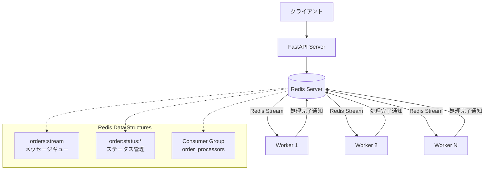
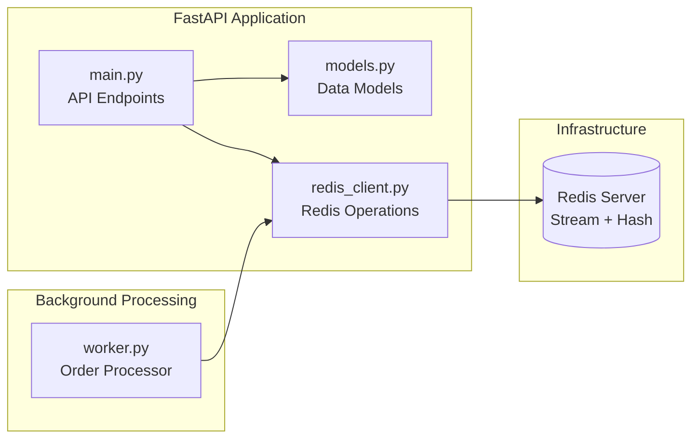
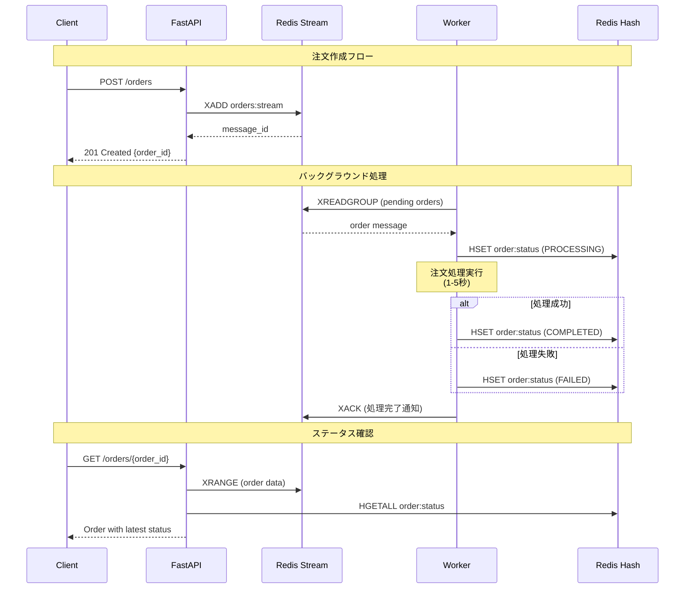
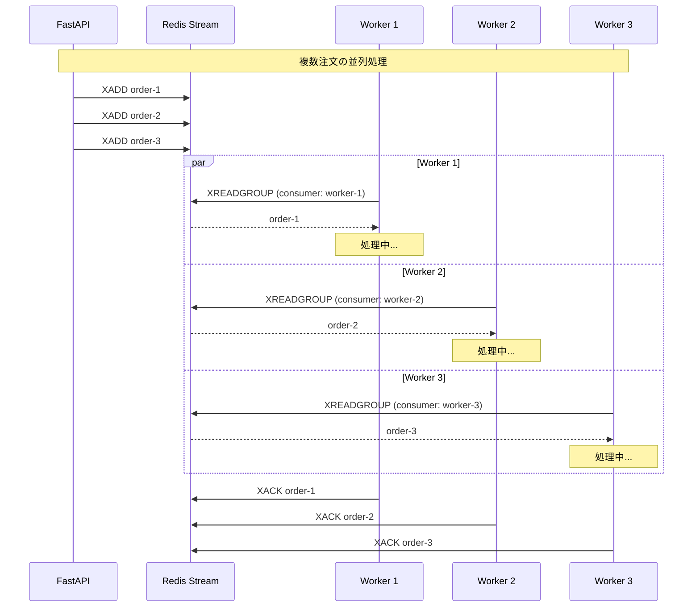

# Redis Stream Order Processing System

Redis Streamを使用したリアルタイム注文処理システムのサンプルアプリケーションです。

## 概要

このプロジェクトは、Redis Streamの機能を活用して以下の要素を含む注文処理システムを実装しています：

- **FastAPI**: RESTful APIサーバー
- **Redis Stream**: メッセージキューとしての注文データ管理
- **Consumer Group**: 複数ワーカーによる負荷分散処理
- **リアルタイム処理**: 注文の投稿から処理完了までのリアルタイム追跡

## システム構成



## コンポーネント構成



## 処理フロー（シーケンス図）

### 注文作成から処理完了まで



### 複数ワーカーによる負荷分散



## データ構造

### Redis Stream (orders:stream)
```
Message ID: 1640995200000-0
Fields:
  customer_id: "customer_123"
  product_id: "product_456" 
  quantity: "2"
  price: "1000.0"
  status: "pending"
  created_at: "1640995200.123"
```

### Redis Hash (order:status:{message_id})
```
Key: order:status:1640995200000-0
Fields:
  status: "completed"
  processed_at: "1640995205.456"
```

## セットアップ

### 前提条件
- Python 3.8+
- Docker Compose

### インストール方法

#### Redis docker compose

```bash
# Redisサーバーを起動
docker-compose up -d redis

# RedisとRedis Insight (Web UI)を起動
# http://localhost:8001 でアクセス
docker-compose up -d

# ログを確認
docker-compose logs -f

# Redisに直接接続
docker-compose exec redis redis-cli

# 停止
docker-compose down
```

#### ローカル環境 FastaAPI(publisher)およびworker

```bash
# 依存関係をインストール
uv sync

# 仮想環境を有効化し、アプリケーションを起動
. .venv/bin/activate
python run.py
```

### 環境変数

| 変数名 | デフォルト値 | 説明 |
|--------|-------------|------|
| `REDIS_HOST` | `localhost` | Redisサーバーのホスト |
| `REDIS_PORT` | `6379` | Redisサーバーのポート |

### サービス一覧

| サービス | ポート | 説明 |
|----------|--------|------|
| **redis** | 6379 | Redis Server |
| **redis-insight** | 5540 | Redis管理WebUI |
| **api** | 8000 | FastAPI Server |
| **worker** | - | バックグラウンドワーカー |

### Redis Insight

Redis Insightは、Redisのデータを視覚的に確認できるWebツールです。

```bash
# Redis Insightを起動
docker-compose up -d redis-insight

# コンテナの状態確認
docker-compose ps

# ログを確認（接続に問題がある場合）
docker-compose logs redis-insight

# ブラウザでアクセス
open http://localhost:5540
```

初回接続時の設定:
- **接続方法**: Manual connection
- **Host**: `redis` (Docker環境の場合) または `localhost` (ローカル環境の場合)  
- **Port**: `6379`
- **Database Alias**: `Redis Stream Demo`
- **Username**: (空白)
- **Password**: (空白)

**Redis Insightが開かない場合の代替方法:**

```bash
# Redis CLIで直接確認
docker-compose exec redis redis-cli

# Streamの内容を確認
127.0.0.1:6379> XINFO STREAM orders:stream
127.0.0.1:6379> XRANGE orders:stream - +

# ハッシュの内容を確認  
127.0.0.1:6379> KEYS order:status:*
127.0.0.1:6379> HGETALL order:status:{message_id}

# コンシューマーグループの状態確認
127.0.0.1:6379> XINFO GROUPS orders:stream
127.0.0.1:6379> XINFO CONSUMERS orders:stream order_processors
```

## Redis Stream の特徴

- **追記専用ログ**: メッセージは時系列順に保存され、削除されません
- **Consumer Group**: 複数のワーカーが協調してメッセージを処理
- **At-least-once delivery**: メッセージは必ず1回以上処理されることが保証
- **範囲クエリ**: 時間範囲やID範囲でのメッセージ検索が可能

## Redis Hash とは

Redis Hashは、一つのキーの下に複数のフィールド-値ペアを格納するデータ構造です。

### Redis Hashの特徴

```mermaid
graph LR
    subgraph "Redis Hash: order:status:123-0"
        F1[status: "completed"]
        F2[processed_at: "1640995205.456"]
        F3[worker_id: "worker-1"]
        F4[processing_time: "3.2"]
    end
    
    subgraph "従来のString Keys"
        K1[order:123:status]
        K2[order:123:processed_at]
        K3[order:123:worker_id]
        K4[order:123:processing_time]
    end
    
    F1 -.->|より効率的| K1
    F2 -.->|メモリ使用量削減| K2
    F3 -.->|原子的操作| K3
    F4 -.->|まとめて取得| K4
```

### Redis Hash vs String Keys

| 特徴 | Redis Hash | 複数のString Keys |
|------|------------|-------------------|
| **メモリ効率** | 小さなハッシュは圧縮される | 各キーにオーバーヘッド |
| **原子性** | 複数フィールドを原子的に操作 | 複数コマンドが必要 |
| **取得効率** | HGETALL で一括取得 | 複数の GET が必要 |
| **構造化** | オブジェクト的な表現 | フラットなキー構造 |

### Redis Hash コマンド例

```bash
# ハッシュにフィールドを設定
HSET order:status:123-0 status "processing" worker_id "worker-1"

# 全フィールドを取得
HGETALL order:status:123-0

# 特定フィールドを取得
HGET order:status:123-0 status

# フィールドの存在確認
HEXISTS order:status:123-0 processed_at

# フィールドを削除
HDEL order:status:123-0 worker_id

# ハッシュのフィールド数
HLEN order:status:123-0
```

### このプロジェクトでの活用

- **注文ステータス管理**: `order:status:{message_id}` キーで各注文の詳細情報を管理
- **構造化データ**: status, processed_at, worker_id などを一つのハッシュにまとめて格納
- **効率的な更新**: ステータス変更時に関連する複数のフィールドを原子的に更新

## 拡張可能性

- **水平スケーリング**: ワーカー数を増やして処理能力向上
- **監視**: Redis Streamのメトリクスを監視してパフォーマンス最適化
- **永続化**: Redisの永続化設定でデータ保護
- **フェイルオーバー**: Redis Clusterやセンチネルでの高可用性
